# Pinkas — Software Design Document

**Version:** 0.1
**Date:** July 2026
**Status:** Design for Phase 1. Phases 2–3 appear only where they constrain Phase 1.
**Inputs:** [`PRD.md`](./PRD.md) (Hebrew, v0.1) · [`wireframes.html`](./wireframes.html) (4 screens, 19 annotations)

> The PRD is the source of truth for *what* and *why*. This document is the source of truth for *how*. Where the two disagree, the PRD wins on product intent and this document wins on mechanism — except where noted in [§20](#20-where-this-document-pushes-back), which lists the four places the design deliberately does not do what the PRD asked.

---

## Table of contents

| § | Section | § | Section |
|---|---|---|---|
| 1 | [Scope and traceability](#1-scope-and-traceability) | 11 | [RTL as the default direction](#11-rtl-as-the-default-direction) |
| 2 | [Architecture](#2-architecture) | 12 | [Screens and components](#12-screens-and-components) |
| 3 | [Data model](#3-data-model) | 13 | [Server data-access layer](#13-server-data-access-layer) |
| 4 | [Multi-tenancy and RLS](#4-multi-tenancy-and-rls) | 14 | [WhatsApp integration](#14-whatsapp-integration) |
| 5 | [The private/public boundary](#5-the-privatepublic-boundary) | 15 | [Offline and PWA](#15-offline-and-pwa) |
| 6 | [Authentication](#6-authentication) | 16 | [Security, privacy, retention](#16-security-privacy-retention) |
| 7 | [The backward-scheduling engine](#7-the-backward-scheduling-engine) | 17 | [Testing strategy](#17-testing-strategy) |
| 8 | [The risk engine](#8-the-risk-engine) | 18 | [Performance and accessibility](#18-performance-and-accessibility-budgets) |
| 9 | [Hebrew calendar and dates](#9-hebrew-calendar-and-dates) | 19 | [Forward compatibility](#19-forward-compatibility-phases-23) |
| 10 | [Design system](#10-design-system) | 20 | [Push-back and open questions](#20-where-this-document-pushes-back) |

---

## 1. Scope and traceability

### 1.1 What Phase 1 is

PRD §13 שלב 1 defines the milestone as: *one real instructor manages one complete course end to end.* Everything below serves that sentence. The target is 10 beta users acquired by personal referral.

### 1.2 Story traceability

Every story in PRD §6 is accounted for. "P1" ships in Phase 1; "P2"/"P3" are deferred but the column on the right records what Phase 1 must already do so the deferral stays cheap.

| Story | Summary | Phase | Designed in | Phase-1 obligation |
|---|---|---|---|---|
| A1 | Instructor signup ≤60s, no card | P1 | §6.1 | — |
| A2 | Curriculum builder, drag to reorder | P1 | §3.3 | Deferrable unique constraint on `(curriculum_id, order_index)` |
| A3 | Duplicate a curriculum, copy independent | P1 | §3.3 | — |
| A4 | Default course price | P1 | §3.2 | — |
| B1 | Add bride; date in Hebrew or Gregorian, shown in both | P1 | §9 | — |
| B2 | Choose curriculum → system proposes a backward schedule | P1 | §7 | — |
| B3 | Referral source, free text + accumulating list | P1 | §3.4 | — |
| B4 | Warn immediately if there is not enough time | P1 | §7.4 | — |
| C1 | Today screen as home | P1 | §12.1 | — |
| C2 | Mark session done, tick covered topics | P1 | §3.6 | — |
| C3 | Private note, never reachable by the bride | P1 | §5 | — |
| C4 | "Repeat this" surfaces at the next session | P1 | §5, §12.2 | — |
| C5 | Reschedule → recompute, warn if deadline breaks | P1 | §7.5 | — |
| C6 | Who is at risk of not finishing | P1 | §8 | — |
| D1 | Send a reminder for tomorrow's session | P1 | §14 | — |
| D2 | Edit my own message templates | **P2** | §14.2 | Ship seeded system templates; `message_template` table exists |
| D3 | Send the bride a portal link | **P2** | §6.2 | `portal_token_hash` / `portal_expires_at` columns exist |
| D4 | See what was sent and when | P1 ⚠️ | §14.3 | Partial — see §20.2 |
| E1 | Bride enters by link, no signup | **P2** | §6.2 | — |
| E2 | Bride sees schedule and next session, no notes | **P2** | §5 | `portal_session_view` exists and is tested |
| E3 | Bride downloads shared materials | **P2** | §3.7 | `material.shared_with_bride` exists |
| E4 | Access closes after the wedding | **P2** | §6.2 | `portal_expires_at` exists |
| F1 | Record a payment received | P1 | §3.8 | — |
| F2 | See who owes what | P1 | §12.1 | — |
| F3 | Religious council pays part | **P2** | §3.8 | `payer` enum already models it |
| F4 | Export a yearly summary as CSV | P1 | §16.4 | — |
| G1 | Produce a completion certificate (PDF) | **P2** | — | — |
| G2 | Mark a course complete → bride archived | P1 | §3.5 | — |
| G3 | Post-wedding follow-up reminder | **P2** | — | — |

**Phase 1 = 20 stories. Deferred = 9.**

### 1.3 Explicitly out of scope

Per PRD §5, and unchanged: teams/multiple instructors per account, a shared curriculum library, card processing, automatic invoicing, analytics, a native app, in-app chat, languages other than Hebrew.

---

## 2. Architecture

### 2.1 Stack

| Layer | Choice | Why |
|---|---|---|
| Client | Next.js (App Router), React, TypeScript, PWA | One codebase, server rendering for the 2s budget (§18), installable without an app store (PRD §10.3) |
| Styling | Tailwind with a closed token set | Enforces the single-colour rule in code, not in review (§10) |
| Server | Next.js Route Handlers + Server Actions on Vercel | No separate API tier to operate; a lean team is a stated constraint (PRD §11.3) |
| Database | Supabase Postgres, RLS enforced | RLS is a PRD hard requirement (§7.1), and is native here — [ADR-0002](./adr/0002-rls-as-the-isolation-boundary.md) |
| Auth | Supabase Auth (phone OTP) | Matches the persona's habits (PRD §3.1) |
| Files | Supabase Storage, private buckets, signed URLs | §3.7 |
| Jobs | `pg_cron` | Nightly risk notifications only (§8.4) |
| Hebrew calendar | `@hebcal/core` | §9 |

Rejected alternatives are recorded in [ADR-0001](./adr/0001-nextjs-supabase.md).

### 2.2 The system on one page

```mermaid
flowchart TB
    subgraph clients["Clients"]
        IB["Instructor PWA<br/>Next.js App Router · RTL · offline outbox"]
        BB["Bride browser<br/>link /p#token — no account, no install"]
    end

    subgraph vercel["Vercel — Next.js server"]
        SA["Server Actions +<br/>Route Handlers"]
        DOM["lib/domain — PURE<br/>scheduling · risk · hebrew-calendar · templates"]
        DATA["lib/data — the chokepoint<br/>every instructor read/write, + access_log"]
        POR["lib/data/portal.ts<br/>Postgres login portal_reader · PORTAL_DATABASE_URL"]
    end

    subgraph supa["Supabase"]
        PG[("Postgres 16<br/>RLS on every tenant table<br/>v_course_risk · portal_session_view")]
        AUTH["Auth — phone OTP"]
        ST["Storage — private buckets"]
        CRON["pg_cron — nightly risk job"]
    end

    WA["WhatsApp<br/>wa.me deep link"]

    IB -->|"session cookie · httpOnly"| SA
    IB -->|"one tap, pre-composed"| WA
    BB -.->|"token in fragment → form POST /p/session<br/>then a 30-min MAC-signed cookie"| POR

    SA --> DOM
    SA --> DATA
    SA -->|"phone OTP, issued and verified server-side"| AUTH

    DATA -->|"client carrying the user's JWT<br/>RLS: tenant_id = auth.uid&#40;&#41;"| PG
    DATA -->|"signed URLs, per request"| ST
    POR -.->|"EXECUTE on three portal_* definer functions only<br/>fixed hash predicate · each logs itself"| PG
    POR -.->|"credential not yet designed — ADR-0010"| ST
    CRON --> PG
    AUTH -.->|"auth.users.id = instructor.id"| PG
```



Three things in that picture are load-bearing, and each is enforced somewhere rather than merely intended:

* **`lib/data/` is the only door to the database** for instructor traffic (§13). Nothing in `clients` holds a Supabase client for bride data, which is what makes the access log complete. Nothing in `clients` holds a Supabase key at all: sign-in is a Server Action (§6.1), so the browser has no edge to Auth, and the session JWT travels in an `httpOnly` cookie that script in the page cannot read. The one place the log's completeness does not follow from this picture is a JWT used *outside* it — §13 and [ADR-0009](./adr/0009-session-record-column-revoke.md).
* **`lib/domain/` has no edge to anything.** The two engines are pure functions called by the server layer; they never reach the database, which is what makes §17.2's fixture tests possible and is enforced as a lint error.
* **The dashed edges are the untrusted path.** They originate at a browser with no account. The token never crosses them in a URL: it lives in the link's fragment and reaches the server only in a POST body ([ADR-0011](./adr/0011-portal-link-in-the-fragment.md)). They terminate at three functions that look up by token hash and write their own `access_log` row, executed by a Postgres login that can do nothing else ([ADR-0010](./adr/0010-portal-database-login.md)). The service-role key is on no edge in this picture: it is in no deployed environment. *(Enforced in the database from migration 0008; the portal's Storage edge has no credential yet — ADR-0010, "Not settled".)*

### 2.3 The three access paths

The whole security design follows from there being exactly three ways data is reached, with different trust levels. Nothing else may talk to the database.

```
┌── PATH 1 · INSTRUCTOR (authenticated, high trust) ─────────────────┐
│  Browser ─→ Server Action / Route Handler                          │
│               └─ Supabase client carrying THE USER'S JWT           │
│                    └─ RLS active: tenant_id = auth.uid()           │
│  Reaches: everything belonging to that tenant. session_record's    │
│  private columns only through the audited reader (ADR-0009)        │
└────────────────────────────────────────────────────────────────────┘

┌── PATH 2 · BRIDE PORTAL (unauthenticated, low trust) ──────────────┐
│  Link /p#<token> — the fragment never reaches the server           │
│  Browser ─→ POST /p/session (token in form body)                   │
│               └─ always 303 → /p; sets a MAC'd cookie on success   │
│  Browser ─→ GET /p (cookie: token hash · expiry · MAC)             │
│               └─ lib/data/portal.ts, Postgres login portal_reader  │
│                    └─ EXECUTE only: portal_resolve_token(hash),    │
│                       portal_sessions(hash), portal_rate_limit_hit │
│                         └─ definer, fixed hash predicate, each     │
│                            writes its own access_log row           │
│  Reaches: date, time, place, shared materials. Nothing else.       │
└────────────────────────────────────────────────────────────────────┘

┌── PATH 3 · JOBS (no user, system trust) ──────────────────────────┐
│  pg_cron ─→ SQL in-database, or a Route Handler with a job secret  │
│  Reaches: aggregates for notifications. Never returns note bodies. │
└────────────────────────────────────────────────────────────────────┘
```

Two rules make this hold, and both are testable:

1. **The browser never holds a Supabase client for bride data.** All reads go through `lib/data/` (§13). This is not a style preference — the access log in PRD §10.1 cannot otherwise be written correctly.
2. **The service-role key is in no deployed environment** ([ADR-0010](./adr/0010-portal-database-login.md), enforced in the database from migration 0008). Path 2 holds `PORTAL_DATABASE_URL` instead: its role, `portal_reader`, has no table privileges and can execute three functions, two of which return nothing without a valid token hash. Path 3 runs in-database as `postgres` via `pg_cron`. The Route Handler variant of Path 3 would need a credential of its own; none is designed, and the service key is not the default answer. The production service key lives in the operator's keychain, for GoTrue admin work under §16.2's support procedure, and `SUPABASE_SERVICE_ROLE_KEY` anywhere under `app/`, `lib/` or `components/` is a lint error.

> **Superseded by ADR-0010 (2026-10-04).** The rule read: *"The service-role key is confined to Path 2 and Path 3. It never appears in a code path that accepts arbitrary user input; the only untrusted input it ever sees is a portal token, which is hashed before use."* Three security reviews (#31/#34, #35, #37) found that this held in the codebase and nowhere else: on a live project the key reads every tenant's data and is also the GoTrue admin credential.

### 2.4 Module layout

```
app/
  (instructor)/            Path 1 — authenticated screens
    today/                 plate 01
    brides/[id]/           plate 02
    courses/[id]/schedule/ plate 03
    curricula/ calendar/ finances/ settings/
  p/                       Path 2 — portal shell, plate 04. No shared layout with above.
    session/               the token exchange (Route Handler, ADR-0011)
lib/
  domain/                  PURE. No I/O, no imports from lib/data or supabase.
    scheduling.ts          §7
    risk.ts                §8
    hebrew-calendar.ts     §9
    templates.ts           §14.2
  data/                    Server-only. The single chokepoint. §13
  supabase/                client factories: user-jwt | job. No service-role factory (ADR-0010);
                           portal.ts holds its own Postgres connection
components/
  ui/                      primitives bound to the token set (§10)
  risk/                    the only components allowed to emit colour
```

`lib/domain/` importing anything from `lib/data/` or `lib/supabase/` is a lint error. Keeping the two engines pure is what makes §17's fixture tests possible.

---

## 3. Data model

The authoritative, executable schema is **[`schema.sql`](./schema.sql)** — it becomes `supabase/migrations/0001_init.sql` unchanged. Its verification suite is **[`schema.test.sql`](./schema.test.sql)**. Both have been executed against Postgres 16; see §17.1 for how to run them. This section explains the model and the decisions inside it; it does not restate the DDL, so that the two cannot drift.

### 3.1 Conventions

* `tenant_id uuid` on every tenant-owned table, referencing `instructor(id)`, `on delete cascade`.
* `created_at` / `updated_at` on every table, `updated_at` maintained by the shared `set_updated_at()` trigger.
* `deleted_at timestamptz` soft delete everywhere, with hard deletion available on request (§16.4). Partial indexes are all `where deleted_at is null` so the soft-delete predicate is served, not scanned.
* All instants are `timestamptz`; all civil dates are `date`. Display timezone is `Asia/Jerusalem` (§9.3).
* Money is `numeric(10,2)` with an explicit `currency`. Never floating point.

### 3.2 `instructor` — the tenant

`instructor.id` *is* the `tenant_id`, and equals `auth.users.id`. There is deliberately no separate tenant table: in Phase 1 one instructor is one account, and inventing an `organization` indirection now would be speculative. §19.1 explains why adding it later is a data migration rather than a schema redesign.

Carries `default_price` (A4), `default_buffer_days` (default 14, §7.2), `timezone`, `locale`.

### 3.3 `curriculum` and `curriculum_topic`

A curriculum is a **template**. Topics are ordered by `order_index`.

Drag-to-reorder (A2) rewrites many rows in one statement, which transiently violates uniqueness on `(curriculum_id, order_index)`. The constraint is therefore `deferrable initially deferred` — it is checked at commit, so a single `UPDATE ... FROM (VALUES ...)` reorder succeeds while a genuinely duplicated order still fails. *Consequence to remember:* a deferrable unique constraint cannot serve as an `ON CONFLICT` arbiter, so upserts on topics must target the primary key.

Duplicating a curriculum (A3) is a plain row copy — new ids, no back-reference to the source. "The copy is entirely independent of the original" is the acceptance criterion, and shared rows would violate it.

### 3.4 `bride`

Holds identity, contact, `wedding_date` (+ `wedding_date_source`, §9.1), `referral_source` (B3 — free text; the "accumulating list" is a `SELECT DISTINCT` over the tenant's own prior values, not a lookup table), lifecycle `status`, and the portal token fields (§6.2).

**`bride` has no notes column, deliberately.** Every free-text observation about a bride belongs to a session, in `session_record` (§5). A note field here would be the first crack in the private/public wall, because `bride` is a row the portal path legitimately needs to read.

### 3.5 `course` — a curriculum instance for one bride

Carries `curriculum_snapshot jsonb`, frozen at creation ([ADR-0004](./adr/0004-curriculum-snapshot.md)), `buffer_days`, `target_end_date` (the effective deadline, §7.2), `agreed_price`, and `status`. G2 ("mark complete → archive") is `status = 'completed'` plus `completed_at`.

`curriculum_id` is `on delete set null`: deleting a template must never destroy the history of courses taught from it. The snapshot means nothing is lost when it happens.

### 3.6 `session` and `session_record`

Split in two, because they have different audiences. This is the single most important decision in the schema — see §5 and [ADR-0003](./adr/0003-session-record-separation.md).

* `session` — `scheduled_at`, `duration_minutes`, `location`, `status`. Bride-visible.
* `session_record` — `covered_topic_ids[]` (C2), `private_note` (C3), `needs_review_note` (C4). Never bride-visible, by construction.

Two fields carry design weight:

* **`scheduled_at` is nullable.** `NULL` means *not yet scheduled* — a legitimate state the wireframe names explicitly ("טרם נקבע", plate 02 note 5). The system does not force everything to be planned up front; an unscheduled session near the deadline is what generates risk (§8).
* **`is_pinned`** marks a slot the instructor placed by hand. Recomputation moves unpinned slots around it (§7.5). This is the schema-level expression of wireframe note c4: *the algorithm proposes, it does not decide.*

`rescheduled_from_session_id` links a replacement to what it replaced, which is how §8 distinguishes "cancelled and rebooked" from "cancelled and forgotten". A cancelled session is never deleted — wireframe note b4: it is history, not noise, and it explains why the course slipped.

### 3.7 `material`

Files (Supabase Storage `storage_path`) or links (`url`), enforced mutually exclusive by a `CHECK`. `shared_with_bride` gates portal visibility (E3). Files are served to the portal as short-lived signed URLs generated per request — the storage path is never handed to the browser.

**Open (ADR-0010):** with the service-role key in no deployed environment, nothing on the portal path can currently mint those signed URLs, because `portal_reader` is a Postgres login with no Storage access. This needs a design, from `backend` and `database` with a `security` review, before E3's portal half is built. Putting the service key back for Storage is not the default answer.

### 3.8 `payment`

`amount`, `method`, `payer`, `paid_at`, `receipt_number`. F3 (a religious council paying part) needs no new schema in Phase 2 because `payer` already enumerates it and payments are already many-per-course — only the UI is deferred.

There is no `invoice` table. PRD §5 puts automatic invoicing out of scope; §19.3 notes what integrating Green Invoice would add.

### 3.9 `message_template` and `message_log`

Templates store `body` only. **Variables are parsed from the body (`{{bride_name}}`, `{{date}}`, `{{time}}`, `{{location}}`) rather than stored in a column** — a stored variable list is a denormalisation that can disagree with the text it describes. §14.2.

`message_log` records what was *composed*. See §14.3 and §20.2 for why that word, and not "sent".

### 3.10 `blackout_date`

Instructor-declared unavailability, distinct from calendar-derived skips. The scheduling engine treats both as unavailable but reports them with different reasons, because the bride-facing explanation differs ("skipped — Tisha B'Av" vs "skipped — unavailable").

### 3.11 `access_log`

Append-only. Required by PRD §10.1 ("a access log for every viewing of bride data"). Two deliberate properties:

* **No foreign key to `bride`.** The log must outlive hard deletion of the data it describes, or the erasure of a bride destroys the evidence that she was accessed.
* **Identifiers and actions only — never content.** A log that quoted note bodies would recreate, in a table nobody thought to protect, exactly the data §16 exists to guard.

Writing it correctly is the reason for §13.

---

## 4. Multi-tenancy and RLS

### 4.1 The policy

Every tenant-owned table carries the same policy shape, verified in `schema.test.sql`:

```sql
create policy bride_tenant on bride
  for all to authenticated
  using      (tenant_id = auth.uid())
  with check (tenant_id = auth.uid());
```

`USING` controls what is readable and updatable; `WITH CHECK` stops a tenant from *writing a row attributed to someone else*. Both are necessary — omitting `WITH CHECK` leaves an authenticated user able to insert rows into another tenant. The test suite asserts that such an insert is rejected.

`access_log` is the exception: `INSERT` and `SELECT` for the owning tenant, and no `UPDATE`/`DELETE` policy at all, so an instructor cannot erase her own audit trail.

### 4.2 Views must be `security_invoker`

**This was verified experimentally, and it matters more than it looks.**

A Postgres view executes with the *view owner's* privileges by default. A view created by the migration role therefore bypasses the RLS of whoever queries it. Running the identical view definition both ways against the test fixture:

| View definition | Rows visible to tenant A |
|---|---|
| `with (security_invoker = on)` | 13 — tenant A's sessions only ✅ |
| default (`security_definer` semantics) | **14 — tenant A's, plus one row belonging to tenant B** ❌ |

One leaked row is the whole failure. Both views in `schema.sql` are declared `with (security_invoker = on)`, and §17.1's suite asserts the flag is still set, so removing it fails the build rather than quietly cross-wiring tenants.

This is a general rule for the project: **every view added later must declare `security_invoker = on`.** RLS on the base tables does not save you.

### 4.3 Why RLS and not application-level scoping

PRD §7.1 requires isolation "at the DB level, **not** at the ORM level". The reasoning is that ORM scoping is a filter a developer must remember on every query, and the failure mode of forgetting is silent cross-tenant disclosure. RLS fails closed instead: a missing `tenant_id` predicate returns nothing rather than everything. [ADR-0002](./adr/0002-rls-as-the-isolation-boundary.md).

RLS is defence in depth, not the only defence — §13's data layer also scopes queries. The point is that both must fail before data leaks.

---

## 5. The private/public boundary

The product's central promise, stated in PRD §4.2 and §7.3.ב and repeated in the wireframes: *what the bride sees lives in a different table from the instructor's notes. Hiding it in the UI is a future bug.*

### 5.1 Mechanism

| | Instructor | Bride portal |
|---|---|---|
| Reads | every table, RLS-scoped | `portal_session_view` + shared `material` rows |
| Sees | `private_note`, `needs_review_note`, `covered_topic_ids` | date, time, duration, location, session number, status |
| Path | Path 1 (§2.3) | Path 2 (§2.3) |

`portal_session_view` exposes exactly seven columns:

```
id, bride_id, order_index, scheduled_at, duration_minutes, location, status
```

There is no join from that view to `session_record`. The private fields are not filtered out — they are *not reachable*.

### 5.2 The test is the contract

Two assertions in `schema.test.sql` protect this, and both fail loudly on drift:

1. The view's column list equals that seven-name string exactly. Adding a column to the portal surface — the plausible future mistake, made by someone helpfully "exposing the topic list" — fails CI.
2. `private_note`, `needs_review_note` and `covered_topic_ids` appear in **exactly one** relation across the whole `public` schema. Any new view or table that surfaces them anywhere fails CI.

Assertion 2 is the more valuable one, because it catches the leak at whatever new relation introduces it, not only at the view we already know about.

### 5.3 The related open question

PRD §14 asks whether the bride should see the *topic list* or only dates. This design answers **dates only** for Phase 1, which is also what wireframe plate 04 shows ("אין תצוגת מסלול, אין רשימת נושאים — אלה לא שלה"). If that answer changes, the correct implementation is a **new view** exposing topic titles from `curriculum_snapshot`, never a widening of `portal_session_view` — the topic titles are curriculum content, and `covered_topic_ids` (which topics were actually covered with this bride) remains private regardless.

---

## 6. Authentication

### 6.1 Instructor

Supabase Auth, **phone OTP primary**, email as fallback and recovery. The persona (PRD §3.1) already lives in WhatsApp and Bit; a phone code is the flow she has used a hundred times. Story A1 requires signup under 60 seconds with no credit card, which means no email verification round-trip on the critical path.

**The OTP is requested and verified in a Server Action, not from the browser.** The browser holds no Supabase key — not even the anon key — so it has no edge to Auth (§2.2). The session lands in a cookie set `httpOnly`, `secure`, `sameSite=lax`, path `/`, explicitly: `@supabase/ssr` writes whatever options it is handed and Next's `cookies().set()` does not default to `httpOnly`, so the flags are asserted by a test that reads back the `Set-Cookie` header rather than the options object. This is the primary defence against the bypass [ADR-0009](./adr/0009-session-record-column-revoke.md) describes — a JWT that page script cannot read is a JWT that cannot be replayed against PostgREST from the page.

On first sign-in, a transaction creates the `instructor` row (`id = auth.users.id`) and seeds the system message templates (§14.2), so D1 works before the instructor has ever visited settings.

**App lock.** WebAuthn platform authenticator (Face/Touch/device biometric) gating an already-authenticated session, with cached data cleared from memory on lock. Motivated by PRD §3.1 and §10.1: *she hands the phone to her children.* Stated honestly — this is a shoulder-surfing and casual-access defence, not a cryptographic one; the session token still exists on the device. It is not a substitute for §16's controls.

### 6.2 Bride portal

The bride will not create an account, will not remember a password, and will not install anything (PRD §3.3). Access is a link. Design ([ADR-0005](./adr/0005-hashed-portal-tokens.md), with the link format of [ADR-0011](./adr/0011-portal-link-in-the-fragment.md) and the database access of [ADR-0010](./adr/0010-portal-database-login.md)):

| Property | Decision |
|---|---|
| Link | `https://<host>/p#<token>`. The token is in the **fragment**, which browsers never send, so it never appears in a request line or in any host log (ADR-0011). `/p/<anything>` is a 404 |
| Exchange | An inline script in the `/p` shell reads the fragment, `replaceState`s the address to `/p`, and submits a hidden form to `POST /p/session`. The handler always answers `303 → /p`, for success and every failure alike; only `Set-Cookie` differs. CSRF gate: `Sec-Fetch-Site: same-origin`, or the header absent |
| Session | Cookie `__Secure-p`, `HttpOnly; Secure; SameSite=Strict; Path=/p`, `Max-Age = min(30 min, time to expiry)`, not sliding. Value: token hash, expiry, HMAC under `PORTAL_SESSION_KEY` — never the token. No server-side session table |
| Database access | `lib/data/portal.ts` connects as the Postgres login `portal_reader`, which can only execute `portal_resolve_token(hash)`, `portal_sessions(hash)` and `portal_rate_limit_hit`. Each lookup function has a fixed hash predicate and writes its own `('bride_portal', bride_id)` `access_log` row (ADR-0010; from migration 0008) |
| Token | 32 random bytes, base64url, generated with a CSPRNG |
| Storage | **SHA-256 hash only**, in `bride.portal_token_hash`. The plaintext token exists once, in the response that creates it |
| Lookup | Hash the incoming token, look up by hash — an indexed equality match, so no timing signal from the query. The exchange always hashes, always calls the counter and always runs the lookup. Every render re-checks the hash, so revocation, expiry and regeneration apply on the next render whatever the cookie says |
| Expiry | `portal_expires_at`, default `wedding_date + 14 days` (E4) |
| Revocation | Null the hash; regeneration issues a new token and invalidates the old |
| Rate limit | Per-IP and per prefix of the token's **hash** — never of the token, since a prefix of a credential is a partial credential and would sit in the counter in plaintext. Primary control at the edge (rules match `/p` and `/p/*`, with a stricter rule on `POST /p/session` — `docs/runbooks/portal-edge.md`); a Postgres fixed-window counter behind it, called once per exchange, because in-memory counters mean nothing on serverless |
| Indexing | `noindex, nofollow`, and `Referrer-Policy: no-referrer` so the token never leaks through an outbound link |

Storing the hash rather than the token means a database disclosure does not hand the attacker working portal links. This costs nothing — the token is never displayed again after issuance, only re-sent by regenerating.

**The expiry date is shown to the bride** ("הקישור פעיל עד 10.09", plate 04 note 4). That makes it a promise rather than a hidden policy, which is why it is a column with a value and not a constant in code.

**"קישור חד-פעמי" (PRD D3) means one link, not one use.** She is sent one link, with no password, and it works until `portal_expires_at`. A single-use link would break her second visit, and a preview fetcher or link scanner could consume it before she taps it. ADR-0011 records the reading; PRD D3 carries the gloss.

**What the bride's device needs.** Client JavaScript: one inline script, the only way to read a fragment. With it disabled she sees a neutral `<noscript>` line and no portal. History ends at `/p` with no hash. Reload works while the cookie lives, and re-opening the WhatsApp link re-exchanges. WhatsApp's preview, fetched on the sender's phone, can reach only the token-free shell. **Owed before #7 issues a real link:** device checks on Android and iOS that WhatsApp keeps the `#` fragment, that the cookie from the 303 survives the in-app browser, and that Chrome's global history records `/p`, not `/p#<token>` (ADR-0011).

**Until ADR-0011 ships**, the deployed link shape is ADR-0005's `/p/<token>`, and the token-in-logs exposure is handled by `portal-edge.md` §2's "accept, bounded". No real link may be issued under that shape (#54 blocks #7).

### 6.3 Discretion requirements

PRD §3.3 and §10 make discretion functional, not cosmetic — her phone is not always private. Concretely, for the portal:

* Neutral `<title>` and PWA name; no term identifying the subject matter.
* No push notifications with body previews.
* No identifying words in URL paths, meta tags, or Open Graph data.
* No third-party scripts or analytics on portal routes at all — nothing that would place the URL in another party's logs.

Fonts are self-hosted (§10.4) partly for this reason: a runtime request to Google Fonts from a portal page puts the page load in a third-party log.

---

## 7. The backward-scheduling engine

PRD §9 calls this "the logic that justifies the system". It lives in `lib/domain/scheduling.ts` as a **pure function** — no I/O, no clock access except an injected `today` — which is what makes the fixture tests in §17.2 possible.

### 7.1 Signature

```ts
export function proposeSchedule(input: ScheduleInput): ScheduleProposal;

type ScheduleInput = {
  today:         CalendarDate;
  weddingDate:   CalendarDate;
  sessionCount:  number;
  cadence:       { kind: 'perWeek'; n: number } | { kind: 'everyNDays'; n: number };
  earliestStart: CalendarDate;
  bufferDays:    number;          // §7.2
  blackouts:     DateRange[];     // blackout_date rows
  pinned:        PinnedSlot[];    // sessions with is_pinned
};

type ScheduleProposal = {
  slots:       Slot[];
  skips:       Skip[];            // §7.3 — surfaced, never silent
  feasibility: Feasibility;       // §7.4 — never a bare complaint
};
```

### 7.2 The buffer

```
effectiveDeadline = weddingDate − bufferDays        (default 14)
```

The buffer exists because **the last session must land before the immersion, not before the ceremony** (PRD §9, plate 03 note 1). It is `course.buffer_days`, per-course and instructor-editable, with the instructor's `default_buffer_days` as the initial value — because there is genuine variation in custom here and the product's stated position (PRD §4.5) is that it hosts practice rather than ruling on it. The wireframe shows it as a visible, editable field for the same reason.

PRD §14 asks what the right buffer is. The design's answer is that **this is not a question the product should answer** — 14 days is a default, the field is editable, and the value is remembered per instructor after she first changes it.

### 7.3 Algorithm

1. Compute `effectiveDeadline`.
2. Build the unavailable-day set over `[earliestStart, effectiveDeadline]`:
   * **Shabbat** — Friday sunset to Saturday nightfall (§9.2).
   * **Yom Tov and chol hamoed** as configured, **fast days**, from `@hebcal/core`.
   * **`blackout_date`** rows for this tenant.
3. Place pinned slots first; they are immovable.
4. Fill remaining sessions **backward from `effectiveDeadline`** at the requested cadence, stepping over unavailable days and recording each step-over as a `Skip`.
5. If the walk runs past `earliestStart` before all sessions are placed, the schedule is infeasible — compute a remedy (§7.4).
6. Assign topics from `curriculum_snapshot` in order.

Backward placement, not forward, is the whole point: it anchors on the constraint that cannot move.

### 7.4 Warnings must carry a remedy

Wireframe note c2 is unusually specific and worth honouring literally: *"'Too tight' alone is a complaint. 'Suggestion: two sessions a week' is help. A warning with no way out is a product bug."*

That is encoded in the type, so it cannot be forgotten in a future screen:

```ts
type Feasibility =
  | { status: 'ok' }
  | { status: 'tight';      message: string; remedy: Remedy }   // fits, no slack
  | { status: 'infeasible'; message: string; remedy: Remedy };  // does not fit

type Remedy =
  | { kind: 'increaseCadence'; perWeek: number; forWeeks: number }
  | { kind: 'startEarlier';    date: CalendarDate }
  | { kind: 'reduceBuffer';    days: number }
  | { kind: 'reduceSessions';  to: number };
```

`remedy` is non-optional on both non-`ok` variants. **A warning without a way out is a type error, not a copy review.** Remedies are ranked cheapest-first: raising cadence before shortening the buffer, and shortening the buffer before dropping content.

This satisfies B4 (warn at add time) and is the same computation, not a second one.

### 7.5 Recomputation (C5)

Triggered by: rescheduling or cancelling a session, changing the wedding date, changing the buffer, or adding a blackout that collides.

Rules:
* **Completed sessions never move.**
* **Pinned sessions never move.** Everything else reflows around them.
* Recomputation returns a proposal; it does not silently write. The instructor confirms, exactly as at creation — plate 03 gives "ערוך ידנית" the same visual weight as "אשר לוז", and note c4 explains why: *a veteran instructor knows things about this bride that the system does not, and she will abandon a product that argues with her.*
* If recomputation makes the course infeasible, the result is a `Feasibility` with a remedy, and the course starts ranking critical in §8 immediately.

### 7.6 Skips are shown, not hidden

Every skipped date stays in the output with its reason, and the UI renders it struck through with the reason beside it (plate 03). Note c3: *otherwise she will think the system made a mistake.* A silently-skipped Tisha B'Av looks like a bug; a visible "skipped · Tisha B'Av" looks like competence.

---

## 8. The risk engine

The Today screen's ranking (PRD §9, plate 01) — the product's core claim.

### 8.1 Tiers

Implemented twice, deliberately, and each implementation is the source of truth for a different consumer ([ADR-0008](./adr/0008-today-risk-from-the-aggregate.md)):

* **`assessRisk()` in `lib/domain/risk.ts` ranks the Today screen — online and offline alike.** Online, it is fed the aggregate columns `today_screen` returns; offline (§15), `summariseCourse()` builds the same input from cached rows. One function either way, so the screen cannot change its answer when she loses signal. Its fixture table (§17.2) is the contract.
* **`v_course_risk` in `schema.sql` is the source of truth for the nightly job (§8.4)** — which runs in-database and cannot call TypeScript — and is the SQL half of the agreement `schema.test.sql` asserts tier by tier.

The two must still agree tier for tier, because a disagreement now shows up as the nightly notification contradicting the screen. One place they knowingly do not, accepted in ADR-0008:

* **`high` is still decided in SQL.** `stale_cancellations` is counted inside the view's aggregate with the 7-day threshold embedded, and arrives at `risk.ts` pre-counted. Online and offline can therefore still differ on this one tier. Removing that would mean shipping every session to the server.

| Level | Condition | `risk_reason_code` |
|---|---|---|
| `critical` | sessions remaining > whole weeks to the effective deadline | `wont_finish_in_time` |
| `high` | a session was cancelled >7 days ago and never rescheduled | `cancelled_not_rescheduled` |
| `medium` | >21 days since the last completed session | `no_recent_session` |
| `info` | wedding within 30 days, course on track | `wedding_approaching` |
| `none` | — | `null` |

Evaluated in that order; the first match wins.

Two readings the table leaves implicit, both fixed in migration `0003` and asserted in both suites:

* **The clock is the Israeli civil date** (§9.4), never the database session's. The view is `course_risk(jerusalem_date(now()))`, and every threshold — including ">7 days ago" and ">21 days since" — is a civil-day comparison, so the view and `risk.ts` agree on the boundary day as well as either side of it.
* **A course with no `target_end_date` has no `critical` tier** and its `days_to_deadline` is null, never `0` — there is no deadline to miss. It still ranks on the other tiers. (Postgres `greatest()` ignores nulls rather than propagating them, which is how the original view ranked such a course `critical`; the view now handles the null explicitly.)

### 8.2 Computed on read, never stored

Neither implementation stores anything. The aggregate is derived by a view at query time and the verdict by a pure function at render time, so the ranking cannot be stale — there is no job whose failure silently leaves the Today screen showing yesterday's truth. Given the data volume (PRD §3: 10–20 brides per instructor, 50+ for the professional persona), this is comfortably cheap; the supporting indexes are in `schema.sql`.

### 8.3 The reason code is the feature

`risk_reason_code` exists because the wireframe demands an explanation, not a number. Note a3: *"18 days" alone is a number. "4 sessions left · won't finish in time" is a decision.*

The UI renders the code plus its operands into that sentence. The code is machine-readable and language-independent; the sentence is Hebrew and lives in the translation layer. Never store the rendered sentence.

### 8.4 The nightly job

`pg_cron` evaluates `v_course_risk` nightly **only to drive notifications** (Phase 2). It does not populate the screen. For this job the view *is* the source of truth — the screen's is `risk.ts` (§8.1) — which is why the two are held to agreement by tests rather than by one deriving from the other.

### 8.5 Empty state

Specified verbatim in the wireframe and worth implementing exactly: *"הכל בזמן. 2 מפגשים היום."* — no illustration, no greeting. One sentence confirming the system checked. The absence of alarm is information, and it should read as a result, not as an empty container.

---

## 9. Hebrew calendar and dates

### 9.1 Storage

`wedding_date date` is canonical and **always Gregorian**. `wedding_date_source calendar_system` records which calendar the instructor actually typed.

Storing the source matters for B1 ("entered as Gregorian or Hebrew, displayed as both"): a wedding given as כ״ב באב should render primarily as כ״ב באב in her UI, because that is how she and the bride discuss it. Both are always displayed; the source decides emphasis, not availability. Converting on input and discarding the source would lose that.

### 9.2 Shabbat and Yom Tov boundaries

Halachic days run sunset to nightfall, so "Saturday" is not a calendar day. For **scheduling** (§7.3), the engine treats Friday evening through Saturday night as unavailable, using `@hebcal/core` candle-lighting and havdalah times for the instructor's city, with a conservative default location when none is set.

### 9.3 The Phase-1 simplification, stated openly

**Hebrew calendar *dates* are treated as civil dates with no sunset rollover.** A wedding on כ״ב באב maps to one Gregorian date, not to "after sunset on the 21st".

This is safe here because the wedding date drives a deadline measured in days and cushioned by a two-week buffer (§7.2); a one-day boundary error cannot produce a wrong decision at that resolution. It would *not* be safe for anything computing halachic times directly.

If this proves wrong, the change is contained: `wedding_date` gains a companion `wedding_date_after_sunset boolean`, and only `lib/domain/hebrew-calendar.ts` changes. Nothing else reads the conversion.

### 9.4 Timezone

Everything is `Asia/Jerusalem`. `timestamptz` throughout, converted at the edge. Israel observes DST, so date arithmetic that crosses a transition must be done in civil days (`date` arithmetic), never by adding 86 400-second multiples — the scheduling engine works in `CalendarDate`, not epoch seconds, specifically to make this class of bug unrepresentable.

### 9.5 Seasonality

PRD §10.2 and §11.1 note periods when weddings do not occur (Sefirat HaOmer, Bein HaMetzarim). Phase 1 does not model these as scheduling rules — they suppress *weddings*, not *lessons*, and instruction continues through them. They matter to cash-flow display (Phase 2) and to the business model, not to the engine.

---

## 10. Design system

The wireframes are unusually prescriptive, and the annotations state design *rules*, not just appearance. This section turns them into enforceable code.

### 10.1 Tokens

Taken verbatim from the sheet, with two exceptions: `risk.2` and `risk.3` are darkened from the
sheet's `#C2691A` and `#9C8000`, because both failed WCAG AA at their actual 11px size (§18.2, #5).
The hues are held; only the lightness moved.

| Token | Value | Role |
|---|---|---|
| `paper` | `#EBEDF0` | sheet background |
| `paper-line` | `#DDE1E7` | grid rule |
| `ink` | `#101418` | primary text, filled controls |
| `graphite` | `#6B7280` | secondary text |
| `wire` | `#C9CDD4` | borders |
| `wire-soft` | `#E4E7EB` | dividers, inactive fills |
| `screen` | `#FFFFFF` | surface |
| `risk.1` | `#A81E32` | critical |
| `risk.2` | `#9E5415` | high — sheet `#C2691A` |
| `risk.3` | `#8A7100` | medium — sheet `#9C8000` |

### 10.2 The one-colour rule, enforced in the theme

Note a2: *three risk levels only. If colour appears anywhere else it loses its meaning. This is a constraint worth enforcing in tokens, not in design review.*

Implementation, exactly as instructed:

* The Tailwind theme exposes **no chromatic token except `risk.1/2/3`**. Everything else is a neutral. A developer reaching for an accent colour finds that none exists — the constraint is enforced by absence.
* A lint rule bans raw hex and `rgb()` in `components/` and `app/`.
* Only `components/risk/` may reference `risk.*`. Anywhere else is a lint error.

The result: making a "success green" button requires editing the theme, which is a visible, reviewable act rather than an inline convenience.

**Note on `--spec` (`#1B4F9C`).** The wireframe sheet's blue is annotation chrome — callout tags, note numbers, spec strips. It appears nowhere inside a `.viewport`. It is **not a product token** and must not enter the theme. (Verified: every `--spec` reference in `wireframes.html` sits outside the device frame.)

### 10.3 Typography rule

Three families, with a rule the wireframe follows without stating:

| Family | Used for |
|---|---|
| **Suez One** | screen titles only |
| **Assistant** | all prose — names, labels, sentences |
| **IBM Plex Mono** | **machine-readable quantities only** — clock times, dates, day counts, currency, progress fractions (`4 / 8`) |

Every numeric or temporal value in all four plates is mono; no prose ever is. This is what makes "18 יום" and "₪2,400" read as data at a glance. Encoded as a `<Metric>` primitive rather than left to per-component discipline.

Precisely: every *standalone* quantity is mono — the countdown, the time, the sum, the fraction, the section count. A number *inside a sentence* is prose, and the wireframe sets it so: "4 מפגשים נותרו · לא ייגמר בזמן" is Assistant throughout. And only the quantity is mono — in "18 יום" the `18` is a Metric and `יום` stays in Assistant. The string layer returns such copy as a `Phrase` (prose and metric segments), and `<Phrase>` in `components/ui/` renders the metric half through `<Metric>`.

### 10.4 Fonts

Suez One, Assistant and IBM Plex Mono, **self-hosted via `next/font`**, subset to Hebrew + Latin. No runtime request to Google Fonts: it is a render-blocking third-party round trip against the 2-second budget (§18), and on portal routes it would place the page load in a third-party log (§6.3).

---

## 11. RTL as the default direction

`<html lang="he" dir="rtl">`. RTL is not a mode — it is the only direction Phase 1 ships (PRD §5 puts other languages out of scope).

* **Logical CSS properties only**: `inset-inline-start`, `border-inline-start`, `padding-inline`, `margin-inline`. A lint rule bans `left`/`right`/`ml-*`/`mr-*`/`pl-*`/`pr-*`.
* This enforces existing practice rather than introducing policy — `wireframes.html` already uses logical properties throughout (`border-inline-start` on risk cards, `inset-inline-start` on callouts).
* Numerals, times and currency stay LTR inside RTL text; the `<Metric>` primitive (§10.3) sets `dir="ltr"` on its own content so `17:00` and `₪2,400` never reorder.
* Icons implying direction (the back arrow, `→` in the wireframe's `.backbar`) mirror with direction.
* All strings live in a translation layer from day one. Not for translation — for keeping copy out of components, so the risk sentences in §8.3 can be composed from reason codes. The layer is `lib/i18n/` (catalog in `he.ts`), and a lint rule makes a Hebrew literal anywhere under `app/` or `components/` an error. It owns Hebrew counting too, which concatenation gets wrong: "יום אחד", "יומיים", "9 ימים", "18 יום".

---

## 12. Screens and components

Four screens, in the wireframes' own priority order.

### 12.1 Plate 01 — Today (`/today`)

The home screen, and per PRD §8 the proof of the product: *if she does not open it every morning, the product has failed.*

Order on screen is the design argument, and must not be "improved" into a calendar-first layout: **risk first, then today's sessions, then money.** Note a1: *she already remembers today's meeting; the bride who is about to get stuck is the one she doesn't.*

| Block | Source | Notes |
|---|---|---|
| At-risk brides | `today_screen`'s risk aggregate → `assessRisk()` (§8.1), ordered by level | The only colour on the screen (§10.2). Each row states its reason (§8.3) |
| Today's sessions | `session` where `scheduled_at::date = today` | One-tap reminder → §14 |
| Open payments | `payment` vs `course.agreed_price` | One number, detail behind a tap |

**Money is a summary, not a list** (note a5): weekly worry, not daily — it does not earn space in the first scroll.

Rendered server-side from **one aggregated query** (§18).

### 12.2 Plate 02 — Bride card (`/brides/[id]`)

PRD §8 marks this the central screen; the wireframe says 80% of usage and *"opened before every session."*

* Countdown (`18 יום`) pinned to the name — days, not dates. Note b1: *a date requires arithmetic; days do not.* Its colour is the bride's risk level, consistent with plate 01.
* Progress as **eight discrete segments, not a continuous bar** (note b2) — sessions are the unit she actually thinks in.
* Tabs: sessions / details / payments / messages.
* **The `needs_review_note` carry-forward floats to the top of the next session** (note b3) — the feature that turns record-keeping into a working tool. She opens this card sixty seconds before the meeting; this is what she needs to see.
* Cancelled sessions stay on the timeline, struck through (note b4).
* **One primary action, context-dependent** (note b6): "Mark session done" becomes "Schedule session 7" after marking. At any moment there is exactly one reasonable thing to do — a menu would be a design failure here.

### 12.3 Plate 03 — Proposed schedule (`/courses/[id]/schedule`)

The §7 engine's UI. Inputs (curriculum, wedding date, cadence, **visible editable buffer**), the feasibility warning **with its remedy** (§7.4), the proposed slots with **visible skips** (§7.6), and two equally-weighted actions — "Confirm" and "Edit manually" (note c4).

### 12.4 Plate 04 — Bride portal (`/p`)

Phase 2, but designed now because its constraints reach back into Phase 1 (§5, §6.2).

*A different product entirely.* 2–5 visits total, ever.

* **No navigation, no menu, no logo** (note d1). She is not "using a system" — she is checking when the meeting is. Every additional element is friction on someone already stressed.
* "When and where" occupies half the screen. No course view, no topic list (note d2 — *those are not hers*).
* Shared materials, a message action, add-to-calendar.
* Visible expiry date (§6.2).
* Separate route group with **no shared layout** with the instructor app — no shared nav, no shared providers, nothing that could import an instructor-side query.
* Two routes, both in that group: the `/p` shell, which renders the portal when the session cookie is valid and a neutral "open the link you received" line when not; and the `POST /p/session` exchange. The token arrives in the fragment, never in the path (§6.2, [ADR-0011](./adr/0011-portal-link-in-the-fragment.md)). Both send `Referrer-Policy: no-referrer`, `X-Robots-Tag: noindex, nofollow` and `Cache-Control: no-store, private`.

---

## 13. Server data-access layer

**All bride-data reads and writes go through `lib/data/`, server-side. The browser never holds a Supabase client for bride data.**

This is an architectural constraint with a specific cause, not a stylistic preference.

PRD §10.1 requires an access log for **every viewing** of bride data. Reads do not fire database triggers — Postgres has no `AFTER SELECT`. So the log can only be written where reads are issued, and it can only be *complete* if reads are issued in one place. A direct browser-to-Supabase query, which the client library makes trivially easy, would be an unlogged read: invisible to the audit trail that §16 depends on.

Consequences, accepted deliberately ([ADR-0006](./adr/0006-server-only-data-access.md)):

* Realtime subscriptions are unavailable in Phase 1. Nothing in the PRD needs them.
* Every screen is server-rendered or fetched through a Server Action — which is also what §18's latency budget wants.
* No Supabase key is shipped to the browser at all — sign-in is a Server Action (§6.1).

Shape:

```
lib/data/
  brides.ts      listBrides, getBrideCard, createBride
  courses.ts     createCourse (snapshot), recomputeSchedule, confirmSchedule
  sessions.ts    markDone, cancel, reschedule
  records.ts     upsertSessionRecord     ← private data; §5. Reads via the audited reader, ADR-0009
  today.ts       getTodayScreen          ← the single aggregated query; §18. Risk via risk.ts, §8.1
  portal.ts      resolvePortalToken, getPortalView   ← Path 2 ONLY; portal_reader login, ADR-0010
  audit.ts       logAccess               ← called by every instructor-path function above
```

**The portal door (ADR-0010, from migration 0008).** `portal.ts` is the only module that reads `PORTAL_DATABASE_URL`, and the only one importable from `app/p/`. It opens a Postgres connection as `portal_reader` through Supavisor and calls the `portal_*` functions — nothing else, because the role can execute nothing else. It holds no Supabase client of any kind. Its lookups take the token **hash** (from the exchange, or from the verified session cookie of [ADR-0011](./adr/0011-portal-link-in-the-fragment.md)), never a `bride_id`, so there is no filter to forget: the predicate is written once, inside each function. **It does not call `logAccess`.** Each lookup function writes its own `('bride_portal', bride_id)` row in the same statement as the read, and only when a row resolved. The portal half of the log is therefore complete against any caller holding the credential, not only against this module. A lint boundary enforces both directions: `app/p/` cannot import instructor data modules, and instructor modules cannot import `portal.ts`. `SUPABASE_SERVICE_ROLE_KEY` anywhere under `app/`, `lib/` or `components/` is a lint error.

**How the instructor path writes the log (from migration 0009).** `audit.logAccess` calls the `log_access(bride_ids, action, resource, request_id)` definer function, which takes the actor from the JWT claims. `authenticated` has no `INSERT` on `access_log`, so a session cannot write a row attributed to anyone else, including a forged `'support'` row. Until 0009 lands, `logAccess` inserts directly and that forgery is possible.

**Where the door stops.** Everything above makes the log complete for traffic that uses this codebase. It does not make it complete for the deployment: Supabase exposes `public` through PostgREST, so a valid instructor JWT used directly — a stolen session, a support session (§16.2) — reads whatever `authenticated` is granted, with no `lib/data/` call and no log row. RLS still holds it to one tenant. Two answers, both in [ADR-0009](./adr/0009-session-record-column-revoke.md): the session cookie is `httpOnly` so page script cannot obtain the JWT (§6.1), and `authenticated` holds no `SELECT` on `session_record`'s three private columns, which are readable only through a `security definer` reader that writes its own `access_log` row in the same statement. The second stops at `session_record` by decision: `bride` and `session` stay directly readable by a JWT used outside the codebase, and that gap is accepted rather than closed with more definer readers.

---

## 14. WhatsApp integration

PRD §4.4: *WhatsApp is the channel, not the system. We do not try to replace it — we connect to it.*

### 14.1 Mechanism

Deep link to `https://wa.me/<phone>?text=<encoded>`, opening WhatsApp with the message pre-composed. The instructor presses send.

**One tap, no intermediate screen** (note a4): *the most common action in the product must be the shallowest.* From the Today screen, "תזכורת" goes straight to a populated WhatsApp thread — no preview dialog, no confirmation step.

Phone numbers are normalised to E.164 (`+9725…`) on write.

### 14.2 Templates

Bodies contain `{{bride_name}}`, `{{date}}`, `{{time}}`, `{{location}}`, `{{instructor_name}}`. Rendering is a pure function in `lib/domain/templates.ts`; unknown variables render empty and are reported by the editor rather than emitting a literal `{{typo}}` into a message to a client.

Phase 1 seeds system templates at signup (§6.1). D2 (instructor-authored templates) is Phase 2; the table already supports it.

### 14.3 The honest limitation

A `wa.me` deep link **cannot confirm delivery, or even that send was pressed.** The user may edit the text or abandon the thread.

Therefore `message_log.status` is **`composed`**, never `sent`, and the UI says "נשלחה תזכורת" only where it means "you opened a reminder", worded so it does not claim more than it knows. This partially under-delivers D4 ("I see what was sent and when") — see §20.2. Closing the gap requires the WhatsApp Business API, which brings template pre-approval, per-message cost, and a Meta business verification the persona is unlikely to complete. [ADR-0007](./adr/0007-wa-me-deep-links.md) records the trade; Phase 3 revisits it.

---

## 15. Offline and PWA

Scoped exactly to PRD §10.3's promise — *view the schedule and add a note* — and no further.

| Capability | Offline behaviour |
|---|---|
| Today screen, bride cards | Served from cache, with a visible "last updated" time |
| Viewing schedules | Cached |
| Adding a note / marking done | Queued in an IndexedDB outbox, replayed on reconnect |
| Everything else | Requires connectivity, and says so |

**Conflict resolution: per-field last-write-wins on `updated_at`.** Chosen because the realistic conflict — one instructor, two devices, or one device replaying a stale queue — is rare and low-stakes. Notes are append-oriented and single-author; CRDTs would be unjustified complexity here. The one guard: an outbox entry older than 7 days is surfaced for confirmation rather than replayed silently, because a week-old queued edit may no longer be what she wants.

Offline risk on the Today screen is computed by `assessRisk()` from cached rows — the same function that ranks it online (§8.1), so the screen's verdict does not switch on connectivity, except on the `high` tier as ADR-0008 records.

Install prompt after the third session (PRD §10.3, PWA to home screen without an app store). App name and icon are neutral (§6.3).

---

## 16. Security, privacy, retention

PRD §10.1 is unambiguous: *the database holds names, phone numbers, wedding dates and personal notes about religious women. A leak is not a malfunction — it is the end of the product and the end of the customers' professional reputations.* Design follows from treating that as the primary requirement rather than a checklist.

### 16.1 Controls

| Control | Design |
|---|---|
| Tenant isolation | RLS, §4, tested |
| Private/public boundary | Physical table separation, §5, tested |
| In transit | TLS, HSTS |
| At rest | Provider-managed encryption + full-disk |
| Access log | `access_log`, written by `lib/data/audit.ts`, §13; private-note reads logged in-database by the audited reader, ADR-0009; portal reads logged in-database by the portal functions, ADR-0010 (from 0008); from 0009 written only by functions, never by a direct insert |
| App lock | WebAuthn, §6.1 |
| Portal | Tokens carried in the URL fragment and stored only as hashes, a 30-minute MAC'd session cookie, expiry, rate limit, no indexing, §6.2, ADR-0011; a dedicated database login with `EXECUTE` on three functions only, ADR-0010 |
| Service-role key | In no deployed environment; operator keychain only, ADR-0010 (from 0008) |
| Backups | Provider PITR **plus a restore drill that is actually performed** — an untested backup is not a backup |
| Dependencies | Lockfile, automated advisories, minimal third-party JS; **zero third-party scripts on portal routes** |
| Data residency | Frankfurt (`eu-central-1`) — §16.6 |

### 16.2 The unanswered question that blocks development

PRD §14 lists it first: *can the product team read the notes? An explicit decision is required before the first line of code.*

**Recommendation: no, by default — and enforced, not promised.**

* Production database access requires a break-glass procedure: a named person, a stated reason, a time limit, and an entry in `access_log` with `actor_kind = 'support'`.
* Support tooling exposes metadata (counts, dates, statuses) and never note bodies.
* The policy is published in plain Hebrew in the product, because §11.4 identifies trust as the binding adoption constraint — *a religious woman will not upload intimate notes about brides to an anonymous startup's cloud.* An unpublished policy buys none of that trust.

This needs a decision from the product owner, not from this document. It is recorded here so it cannot be reached by default.

**Decision (2026-07-27, product owner): yes — currently the product team may read notes.** This supersedes the recommendation above for now. Two consequences still bind: the in-product privacy policy must say so in plain Hebrew (§11.4 — an honest "yes" costs less trust than a discovered "no"), and every support read must land in `access_log` with `actor_kind = 'support'`, so the policy can later be tightened to break-glass without a schema change. The word *currently* is deliberate: this is to be revisited before public launch.

**Fulfilling the attribution in Phase 1 (2026-08-05, #7 design challenge).** It is fulfillable without a `support` Postgres role and without a new `access_log` insert policy. Support reads go through the same door, by **impersonation**: the service key mints a session for the tenant, so `auth.uid()` is the tenant and the existing `with check (tenant_id = auth.uid())` passes unchanged, and the row is written with `actor_kind = 'support'` and `actor_id` = the engineer. A CHECK on `access_log` — `actor_kind <> 'instructor' or actor_id = tenant_id` — makes a support read forged as an instructor's attributable to nobody, which is loud rather than quiet. It needs a support console that goes through `lib/data/`; nothing else.

Impersonation introduces the defect this section forbids if left alone: an impersonated session is indistinguishable from the instructor's own, so the instructor resolver would record a support read as hers. The minted JWT therefore carries an `impersonated_by` claim; the instructor resolver **refuses** any session carrying it, with no fallback, and the support resolver requires it together with a grant id.

Stated plainly, because the order of weight matters: **that refusal is an application-level control, and it binds only tooling we build.** Whoever holds the service key controls the minting and can omit the claim, at which point the session is logged as the instructor's. Against the insider this section is actually about, what holds is the column revoke of [ADR-0009](./adr/0009-session-record-column-revoke.md) — with it, no session reaches a note body except through the logging reader, whatever its claims say. **Until that revoke lands (#34), support-read attribution rests on the application-level refusal alone,** and the published policy should not describe it as stronger than that.

> **Superseded in part by [ADR-0010](./adr/0010-portal-database-login.md) (2026-10-04, #53 design challenge).** The three paragraphs above are kept as the record of the August position. What changed: the `impersonated_by` claim was never minted by anything, and its name and location were pinned nowhere. A session minted with the service key was logged as the instructor's own read. `today_screen` refused the claim while `read_session_records` logged it, so the two functions disagreed. And `authenticated` could insert an `access_log` row with any `actor_kind`, including a forged `'support'` row. "Without a new `access_log` insert policy" no longer holds either: from 0009 the log is written only by functions. The mechanism below replaces the August one.

**Support attribution, settled (2026-10-04, [ADR-0010](./adr/0010-portal-database-login.md)).** Lands with migration 0009, behind a staging spike of the hook. Until then, the August position above is what is deployed.

* **The claim.** Top-level `impersonated_by` (the engineer's uuid) and `support_grant_id`, both in the access token.
* **Who mints it, and how.** A Supabase Custom Access Token Hook, `public.custom_access_token_hook`, executable only by `supabase_auth_admin`. It reads `support_grant` (engineer, tenant, reason, expiry, bound session id), a table only `postgres` can insert into. The hook binds a grant to the session it is issued for and stamps both claims on that session's token and on every refresh. **It refuses `magiclink` and `password` issuance that has no grant.** Instructors sign in by phone OTP (§6.1), so those methods are support-only, and the service key's `generateLink` produces nothing usable without a grant.
* **What the functions do with it.** `today_screen` and `read_session_records` both log `('support', engineer)`. The instructor path's `log_access` takes the actor from the same claims. All three behave the same way, and the tests cover both functions.
* **The procedure.** For each support read of a tenant's data, the operator:
  1. inserts a `support_grant` row: engineer, tenant, reason, expiry;
  2. runs `generateLink` for that tenant from a machine holding the production service key (the operator's keychain; the key is in no deployed environment);
  3. signs in with that link and reads through the product.

  Every read goes through `lib/data/` and lands in `access_log` as `('support', engineer)`. The grant's expiry bounds the session.
* **Reads outside the product.** A dashboard SQL editor or `postgres` read of tenant data is preceded by the `postgres`-only `support_log_access(engineer, tenant, bride_ids, reason)`, which writes the `'support'` rows. pgaudit `read` on role `postgres` is what shows a read where that call was skipped.

**The fallback, named in advance.** The hook is unverified: its `authentication_method` values, whether `session_id` survives refresh, and whether email-OTP fallback shares a method value with the flows it refuses. If the staging spike after 0008 shows the hook cannot do this, then:

* `impersonated_by` becomes a reserved claim, and **both** functions refuse it with `42501`;
* support reads go only through the editor, after `support_log_access(...)`, with pgaudit `read` on `postgres`.

0009's instructor-path half (`log_access`, the `INSERT` revoke) lands either way.

**Residual risk, stated plainly — and to be stated in the published policy no more strongly than this:**

* A read through the SQL editor, or any `postgres` connection, is logged only if the operator calls `support_log_access` first. That call is a procedure, not a control. pgaudit makes skipping it detectable after the fact; it does not prevent it.
* A holder of the production service key can impersonate an instructor and be logged as her. On the hook path, they would have to change her phone with `updateUserById` and sign in by OTP, the one method the hook must allow. On the fallback path, `generateLink` is not blocked at all.
* The hook is switched on and off in the dashboard, by the same people who can open the SQL editor.

What ADR-0010 changes is who holds the key: the operator's keychain only, instead of every deployed environment that ran the portal. Against a leak of anything deployed, attribution is now honest. Against the operator, it is a procedure backed by an audit trail, and must be described as one. The column revoke of ADR-0009 still holds whatever the claims say: no session reaches a note body except through the logging reader.

### 16.3 Client-side note encryption — considered, deferred

PRD §10.1 raises it and names the trade: *sells excellent trust, breaks search — a conscious decision.*

Deferred for Phase 1, because it also breaks server-side rendering of note content (§13), password recovery without data loss, and any future cross-device sync. The honest position: it is the strongest possible answer to §16.2, and if a certification organisation partnership (§11.4) demands it, it becomes a Phase 3 project with its own key-management design — not a flag to be flipped.

### 16.4 Retention, export, erasure

* **Export** (F4): CSV for the accountant, plus a full-account JSON export. User-initiated, no support ticket.
* **Erasure**: soft delete by default; hard delete on request, cascading across the tenant's data. `access_log` retains the record of access, holding identifiers only (§3.11).
* **Retention after completion** is PRD §14's fourth open question. Recommendation: **archive indefinitely, delete never by default.** Completion certificates (G1) may be requested years later, and silent automatic deletion of professional records would be the worse surprise. Bulk deletion is offered as an explicit action.

### 16.5 Legal

Amendment 13 to the Israeli Privacy Protection Law imposes obligations that plausibly apply here (database registration, a security officer, breach notification, DPIA). **This document is not a legal opinion and its author is not qualified to give one.** PRD §10.1 already flags the need for legal review; that review should happen before beta users hold real bride data, not before launch.

### 16.6 Data residency

**The Supabase projects (production and staging) run in `eu-central-1` (Frankfurt).** Decided 2026-07-30 under #27 and signed off by the product owner the same day — a product decision, because it binds the privacy policy, not just a latency number.

Where this database physically sits is a privacy decision (PRD §10.1): it holds names, phone numbers, wedding dates and intimate notes. Supabase offers no Israeli region, so the data leaves Israel whichever region is chosen; the choice is which jurisdiction it lands in.

* **EU over US.** Israel holds an EU adequacy decision, so Israel↔EU transfer of personal data is legally established ground, and the Amendment-13 review (§16.5) argues more simply against an EU-hosted processor than a US-hosted one.
* **Frankfurt over the other EU regions.** The closest major EU region to Israel (~60–80 ms), and one Vercel functions can be co-located with (`fra1` — settled in the Vercel ticket, not here). The §18.1 budget depends on that co-location: every Today-screen render crosses this link.
* **Staging sits in the same region.** It holds fake data only, but parity keeps the residency statement one sentence and the two projects behaviourally identical.

Consequences accepted: moving regions later is a database migration with downtime, not a settings change; and the in-product privacy policy must state where the data is held (§16.2 already requires that honesty).

---

## 17. Testing strategy

### 17.1 Database (written, executed, passing)

`schema.test.sql` is not aspirational — it runs. It asserts, as an ordinary `authenticated` user:

1. Tenant A sees only tenant A's brides — including when addressing tenant B's row by primary key.
2. `session_record` is isolated; `private_note` never crosses tenants.
3. Both views respect the caller's RLS (the `security_invoker` finding, §4.2).
4. `WITH CHECK` rejects an insert attributed to another tenant.
5. An update against another tenant's row affects zero rows.
6. `access_log` is insertable but not deletable.
7. `portal_session_view` exposes exactly the seven permitted columns.
8. The three private field names appear in exactly one relation in the schema.
9. All five risk tiers rank as §8.1 specifies.

Each later migration appends its own section to the suite, headed with its issue numbers — the atomic signup seed (#36), the Israeli-clock risk view (#38, #42), `today_screen` (#35), the platform-grant revokes and the audited `session_record` reader (#31, #34), the portal objects (#37) — so the list above is the floor, not the whole.

To run, with any Postgres 15+:

```bash
./scripts/test-schema.sh                             # as superuser; the CI path
SCHEMA_TEST_AS_MIGRATOR=1 ./scripts/test-schema.sh   # as a non-superuser role shaped like Supabase's
```

The script applies `schema.bootstrap.sql` (which emulates Supabase's `auth.uid()`, roles and default privileges), then every file in `supabase/migrations/` in order, then `schema.test.sql`. It does not read `schema.sql`, which is frozen at `0001_init.sql`: the schema under test is the one that ships.

Non-zero exit means the isolation design regressed. This belongs in CI from the first commit.

### 17.2 Domain engines

Vitest, fixture-table driven, against the pure functions in `lib/domain/`:

* **Scheduling** — Tisha B'Av mid-course (the skip plate 03 actually shows); a wedding closer than the buffer; a wedding *inside* the buffer; Hebrew leap years; multi-day Yom Tov; cadence that cannot fit; every session pinned; a blackout colliding with a pinned session.
* **Risk** — each tier at its boundary (exactly 21 days, exactly 7 days, exactly at the deadline), plus a course with zero sessions.
* **Templates** — unknown variable, empty value, RTL punctuation.

Both engines are pure, so these are fast and deterministic — no database, no clock, `today` injected.

### 17.3 Integration and UI

* Portal access: valid token, expired token, revoked token, malformed token, another tenant's token.
* Playwright smoke tests over the four screens in RTL at 375px, including the empty state in §8.5.
* An automated axe pass for §18.2.

---

## 18. Performance and accessibility budgets

### 18.1 Performance

PRD §10.3: the home screen loads in **under 2 seconds on a cellular connection**. It is the screen she opens every morning; if it is slow she stops opening it, and per PRD §8 that is product failure.

* Today is server-rendered from **one aggregated query** (`lib/data/today.ts`) — risk, sessions and payment totals together. Not three round trips. Risk arrives as the view's aggregate and is ranked by `risk.ts` on the server (§8.1); that changes the select list, not the round-trip count.
* Budget: ≤150 KB JS gzipped on the Today route. The screen is mostly text and borders; the wireframe implies almost no client-side interactivity.
* Self-hosted fonts, subset, preloaded (§10.4).
* Portal routes: no analytics, no third-party JS at all (§6.3).

### 18.2 Accessibility

* Contrast: the token set is high-contrast by construction (`ink #101418` on `screen #FFFFFF`). **The three risk colours must be verified against WCAG AA at their actual sizes** — they are used at 11px in `.risk-days`, which is normal text and needs 4.5:1. If a token fails, darken the token rather than enlarging the text.
  * **Measured (#5):** this document anticipated `risk.3` failing; `risk.2` failed too, for the same reason. On `screen`, the sheet's values gave `risk.1 #A81E32` 7.25:1 (pass), `risk.2 #C2691A` 3.94:1 and `risk.3 #9C8000` 3.82:1 (both fail). Both were darkened, holding their hue: `risk.2 #9E5415` 5.63:1, `risk.3 #8A7100` 4.73:1. The three now also step down in luminance with severity, so their order survives greyscale. `graphite` (4.83:1), used for the reason sentence, passes unchanged.
  * Measured against `screen`, not `paper`: product text renders on `screen`; `paper` is the desk behind the device frame.
  * `components/risk/contrast.test.ts` reads the values from `app/globals.css` and asserts the 4.5:1 floor, so a token cannot drift back silently.
* **Risk is never encoded by colour alone.** The wireframe already pairs every colour with a reason sentence and a day count (§8.3), so the information survives colour-blindness and greyscale. Preserve that pairing.
* Full keyboard operability, visible focus, semantic landmarks, `lang="he"` and `dir="rtl"` on the document.
* Screen-reader labels on icon-only controls, of which the wireframe has few by design.

---

## 19. Forward compatibility (Phases 2–3)

Only what constrains Phase 1 today.

### 19.1 Organisation accounts (P3)

`tenant_id` is present on every table from day one, so introducing an `organization` layer is a data migration (`instructor.organization_id`, policies widened from `= auth.uid()` to a membership test) rather than a schema redesign. Adding the indirection *now* would be speculative complexity for a product whose primary persona is a sole practitioner.

### 19.2 Curriculum library and fork (P3)

`curriculum_snapshot` is versioned (`snapshot_version`), so a future fork mechanism can read courses created under today's shape. PRD §14's risk register warns against the product supplying content — the library is a fork mechanism over user-authored templates, never an official curriculum.

### 19.3 Payments and invoicing (P3)

`payment` already models split payers (F3). Green Invoice / iCount integration adds an `invoice` table and an external id; nothing in Phase 1 blocks it.

### 19.4 Vertical expansion (PRD §11.3)

The strategic option — groom instructors, bar mitzvah teachers, couples counsellors — is the same model: *student · course · deadline · payment*. Phase 1 stays compatible by keeping domain vocabulary at the boundary. The entities are already structurally generic; `bride`/`instructor` are naming choices over a shape that generalises. A rename is a migration, not a rewrite — but it should not be pre-emptively abstracted now, because the concrete naming is worth more to the only users who currently exist.

---

## 20. Where this document pushes back

Four places the design deliberately does not do what was asked, plus the questions that remain open.

### 20.1 The premise — validated (2026-07-27)

PRD §15 was explicit that the core assumption — *the central pain is the deadline, not organisation* — had not been tested, and prescribed 8–10 depth interviews before any code.

**Resolved (2026-07-27, product owner): the premise is validated.** The deadline is confirmed as the core pain, with one qualification: organisation and the ability to share materials with the bride matter too. That qualification does not change the core (§7 and §8 stand); it confirms that the material-sharing path (§3.7, the bride portal in §5–§6) belongs in Phase 1 rather than being a candidate for cutting.

### 20.2 D4 is only partially satisfiable

"I see what was sent and when" cannot be delivered by `wa.me` links. Phase 1 shows what was *composed*. Shipping a "sent ✓" indicator that means "we opened WhatsApp" would be a small lie in exactly the place — messages to clients — where the product cannot afford one. §14.3.

### 20.3 Biometric lock is weaker than it sounds

PRD §10.1 lists it among encryption and RLS. It is not that class of control: it gates the UI, not the data, and the session token remains on the device. It is worth building for the stated reason (she hands the phone to her children), but it should not be represented to users as protecting their data from a lost phone. §6.1.

### 20.4 The team-access question blocks the first commit — resolved

§16.2. The PRD asks it; this document recommends an answer and a mechanism; someone must actually decide. It is listed here rather than in a backlog because the honest answer changes what gets built — publishing "no one can read your notes" while support tooling can is worse than never claiming it.

**Resolved (2026-07-27): yes, currently — see the decision in §16.2.** Development is no longer blocked; what remains is publishing the policy honestly and revisiting it before public launch.

### 20.5 Open questions carried forward

| PRD §14 question | Phase-1 default | Where |
|---|---|---|
| Can the product team read notes? | **Resolved 2026-07-27: yes, currently** — reads logged in `access_log`; revisit before public launch | §16.2 |
| What is the right buffer before the wedding? | 14 days, editable, remembered per instructor | §7.2 |
| Should the bride see topics, or only dates? | Dates only; a change means a new view, never a wider one | §5.3 |
| What happens to data after completion? | Archive indefinitely; explicit bulk delete offered | §16.4 |
| Is there a formal rabbinate reporting requirement? | **Unknown — needs research.** Would add an export format; no schema impact expected | — |

---

## Appendix A — Document map

| File | Role |
|---|---|
| [`PRD.md`](./PRD.md) | Product requirements (Hebrew), v0.1 — the *what* and *why* |
| [`wireframes.html`](./wireframes.html) | 4 annotated screens — open in a browser |
| `SDD.md` | This document — the *how* |
| [`schema.sql`](./schema.sql) | Authoritative schema; becomes migration `0001_init.sql` |
| [`schema.test.sql`](./schema.test.sql) | Isolation and risk-tier verification |
| [`schema.bootstrap.sql`](./schema.bootstrap.sql) | Supabase emulation for local testing |
| [`schema.bootstrap.migrator.sql`](./schema.bootstrap.migrator.sql) | Opt-in second bootstrap stage: applies the migrations as a non-superuser role shaped like Supabase's (`SCHEMA_TEST_AS_MIGRATOR=1`, §17.1) |
| [`adr/`](./adr/) | Eleven decision records |
| [`runbooks/`](./runbooks/) | Operator procedures: provisioning, Vercel and the environment matrix, migration delivery, portal edge controls |

## Appendix B — Decision records

| ADR | Decision |
|---|---|
| [0001](./adr/0001-nextjs-supabase.md) | Next.js + Supabase |
| [0002](./adr/0002-rls-as-the-isolation-boundary.md) | Postgres RLS as the isolation boundary |
| [0003](./adr/0003-session-record-separation.md) | `session_record` as a separate table |
| [0004](./adr/0004-curriculum-snapshot.md) | Curriculum snapshot at course creation |
| [0005](./adr/0005-hashed-portal-tokens.md) | Hashed opaque portal tokens |
| [0006](./adr/0006-server-only-data-access.md) | Server-only data access |
| [0007](./adr/0007-wa-me-deep-links.md) | `wa.me` deep links over the Business API |
| [0008](./adr/0008-today-risk-from-the-aggregate.md) | Today ranks risk in `risk.ts` from the view's aggregate, not the view's verdict |
| [0009](./adr/0009-session-record-column-revoke.md) | Private note columns readable only through an audited reader |
| [0010](./adr/0010-portal-database-login.md) | The portal gets its own Postgres login with `EXECUTE` on hash-keyed, self-logging functions only; the service-role key leaves every deployed environment; support attribution via an access-token hook |
| [0011](./adr/0011-portal-link-in-the-fragment.md) | The portal token travels in the URL fragment, exchanged by form POST for a short MAC'd session cookie (supersedes ADR-0005's URL path) |
